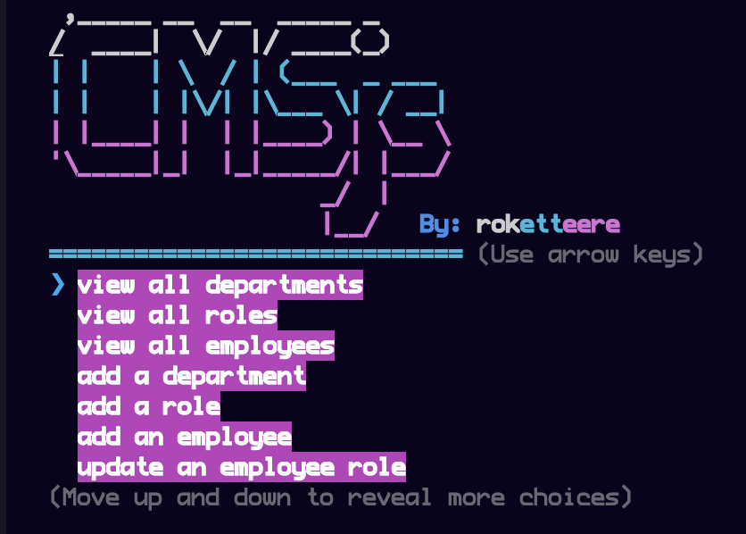

# CMSjs - Command Line Interface

## Description

Using JS, Nodejs, Inquirer, MySql2, and the Colors package, I have created a CLI
program that simulates a CMS application. This is a light weight app designed to
be built on top of.

## Demo

https://user-images.githubusercontent.com/1593262/236070100-75acf86c-7002-4e68-89b1-9bb766e3a511.mov

## Installation

1. clone repository
2. cd into the root directory and run the command: `"npm i"`

## Usage

Once all the packages are installed run: `"node index.js"` and follow the prompt

## HerokuApp - Deployed Link Live Demo
https://techytimeblog.herokuapp.com/

## License

MIT

## Github

https://github.com/roketteere

## Contact

jxp489@gmail.com
